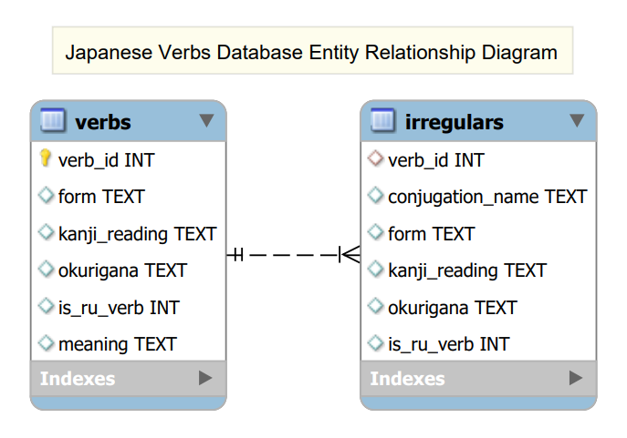

# cs310_project

Project for CS310 Web Development. A website that helps a user practice their Japanese conjugation skills. The website will prompt the user to conjugate a verb to one of a variety of conjugation types, and will check the user's answer while showing the correct one. The site also has links to useful resources and examples of each conjugation type. The site is rather configurable, with the ability to choose which conjugations will be used. The site also tracks the user's accuracy for each conjugation type and can display them in a graph on the statistics page. This site was built using the tools listed below. Scroll down to the setup section to see how to install and setup the website.

### Tools Used

* Bootstrap 5.3.2
* JQuery 3.7.1
* [coolors.co](https://coolors.co/)
* Node JS
* Chart.js

### Required Node Packages

* Express
* Sqlite
* Sqlite3
* Multer
* Nodemon

### Setup

1. Install Node JS on system using a node package manager (npm)
2. Clone this repository to your computer
3. Open command prompt to the folder of the cloned repository and install the required node packages by running `npm install`
4. Nodemon is a package that will be used to run the server so install it globally using the command `npm install -g nodemon` if you are using npm
5. To start the server, type "nodemon" in the open cmd prompt terminal
6. Open your browser to [http://localhost:8080/home.html]([http://localhost:8080/home.html]()) to see the working site
7. If by any chance there are problems with the pre-made database, you can remake it by opening a command prompt window in the project directory and running the command `sqlite3 jp_verbs.db < database_sql.sql`. Please note that the `sqlite3` command may not work unless you have the sqlite3 executable from sqlite tools, which is available at [https://www.sqlite.org/download.html]()

### Database Design

* The database has 2 tables that are both used by the node server to provide the data for the server-side API
* The verbs table contains all the necessary components to fill in the practice page with information, and also has extra metadata required for conjugations
* The irregulars table has irregular conjugations of verbs in the verbs table, and the two are linked by the verb_id
* See the "database_sql.sql" file for more information
* To remake the database using the sql script, follow step 7 of the setup above

### Server-Side API

* Making a GET request to http://localhost:8080/verbs will return a JSON array containing all verbs from the database
* Making a GET request to http://localhost:8080/verbs?type=random will only return the data of one random verb
* Making a POST request to http://localhost:8080/irregulars will return an error because parameters are required
* Making a POST request to http://localhost:8080/irregulars with the parameter "verb_id" will return an array of all irregulars for that verb
* Making a POST request to http://localhost:8080/irregulars with the parameters "verb_id" and "conjugation_name" will return the irregular for verb X when conjugated to form Y
* The irregulars API will often return blank JSON because most verbs do not have irregular conjugations

